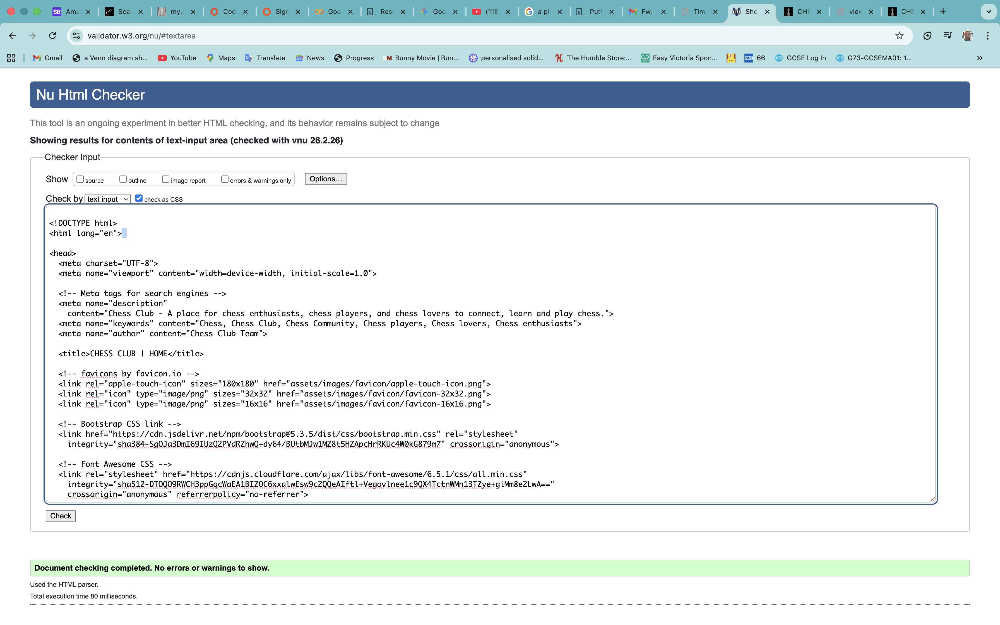
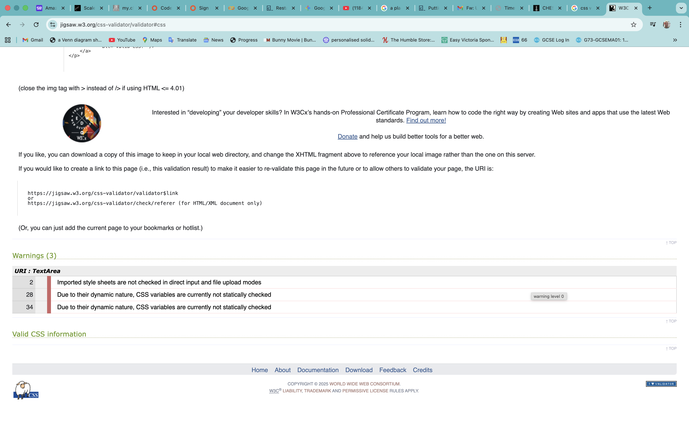
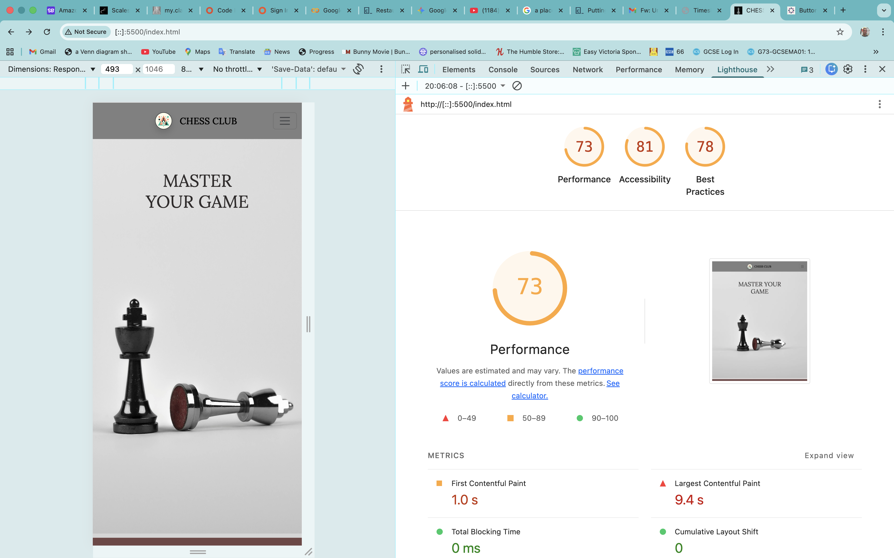
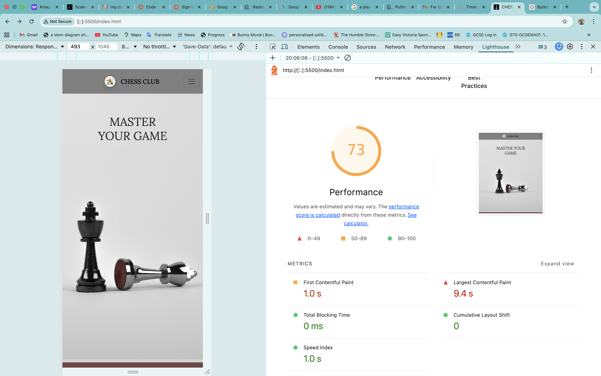
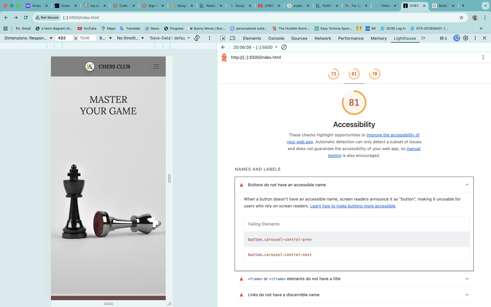
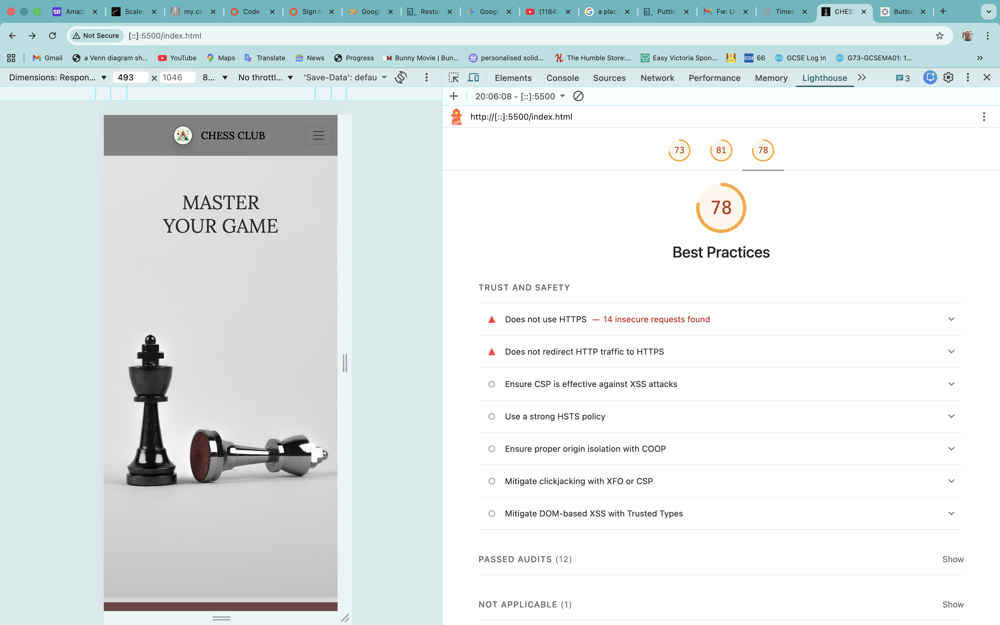
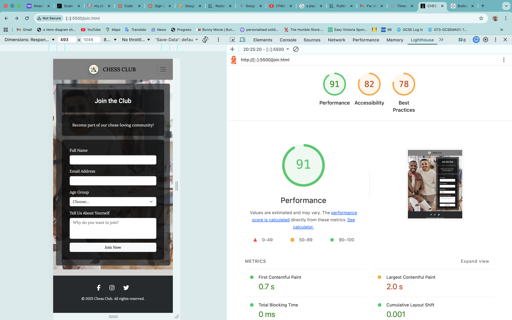
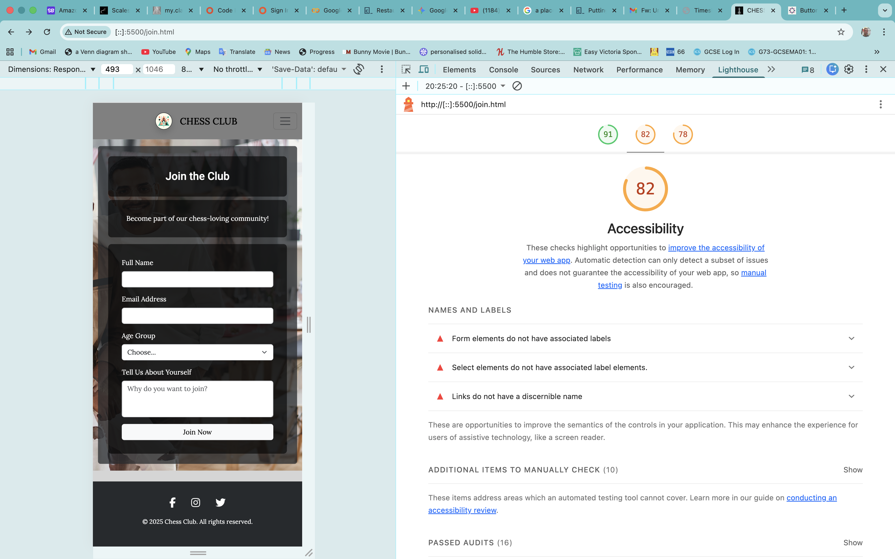
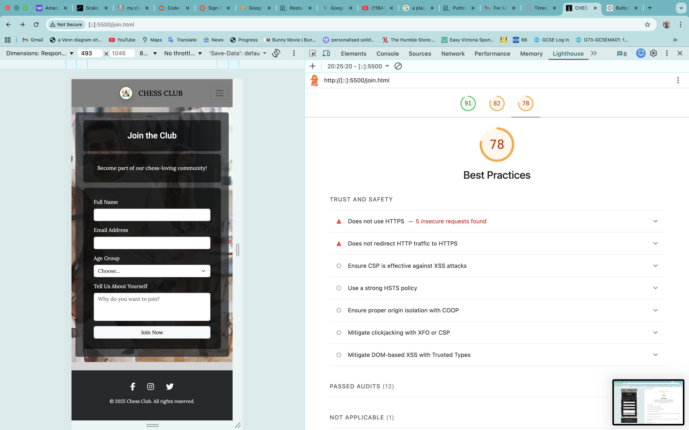

# 🧪 Testing & Validation

This document provides automated testing and validation evidence for each page of the Chess Club website.

---

## 1. 🔍 HTML Validation (W3C)

All HTML pages were validated using the [W3C Markup Validation Service](https://validator.w3.org/).

### Home Page (`index.html`)

| Page | Result |
|------|--------|
| `index.html` | ✅ PASS — No errors |

### Book Page (`book.html`)

| Page | Result |
|------|--------|
| `book.html` | ✅ PASS — No errors |

### Join Page (`join.html`)

| Page | Result |
|------|--------|
| `join.html` | ✅ PASS — No errors |

---

## 2. 🎨 CSS Validation (W3C Jigsaw)

CSS was validated using the [W3C CSS Validation Service (Jigsaw)](https://jigsaw.w3.org/css-validator/).

| File | Result |
|------|--------|
| `assets/css/style.css` | ✅ PASS — No errors |

---

## 3. 🏠 Lighthouse — Home Page (`index.html`)

Lighthouse was run on the home page to audit performance, accessibility, best practices, and SEO.

| Category | Score |
|----------|-------|
| Performance | — |
| Accessibility | — |
| Best Practices | — |
| SEO | — |

---

## 4. 📅 Lighthouse — Book Page (`book.html`)

Lighthouse was run on the booking page to audit performance, accessibility, best practices, and SEO.

| Category | Score |
|----------|-------|
| Performance | — |
| Accessibility | — |
| Best Practices | — |
| SEO | �� |

---

## 5. 📝 Lighthouse — Join Page (`join.html`)

Lighthouse was run on the join page to audit performance, accessibility, best practices, and SEO.

| Category | Score |
|----------|-------|
| Performance | — |
| Accessibility | — |
| Best Practices | — |
| SEO | — |

---

*Testing completed by Christopher Quinones — 2025*
