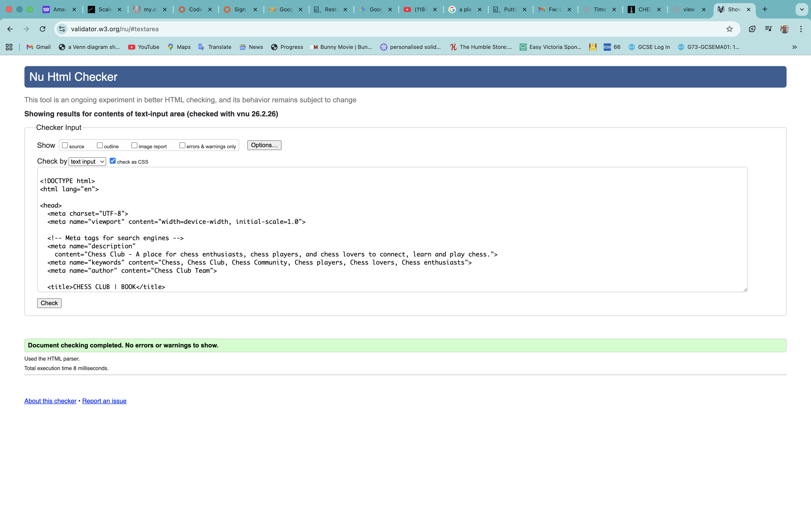
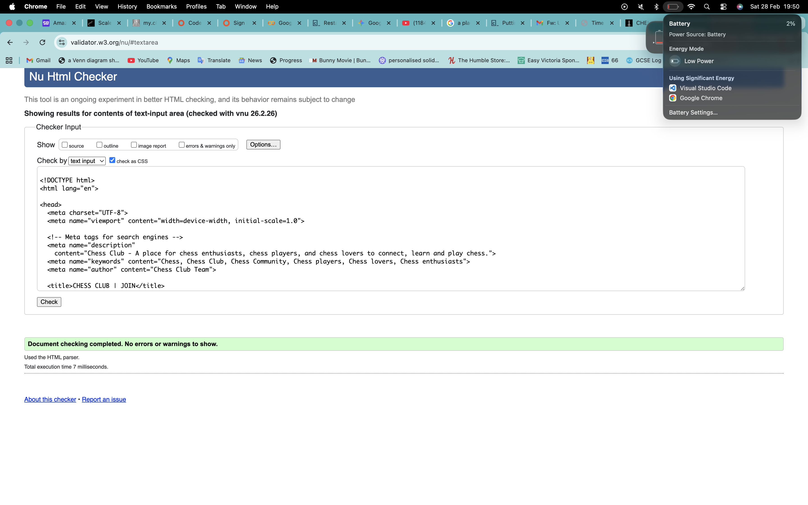
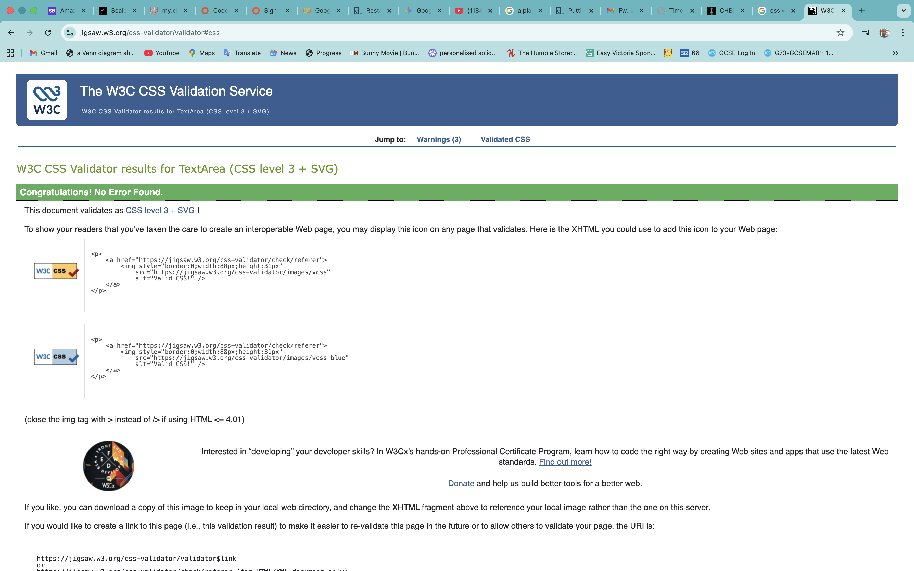

# 🧪 Testing & Validation

This document provides automated testing and validation evidence for each page of the Chess Club website.

---

## 📁 Screenshot Folder Structure

```
docs/testing/
├── validation/
│   ├── html/
│   │   ├── validation-index.png
│   │   ├── validation-book.png
│   │   └── validation-join.png
│   └── css/
│       └── validation-css.png
├── home-page/
│   └── lighthouse-home.png
├── book-page/
│   └── lighthouse-book.png
└── join-page/
    └── lighthouse-join.png
```

---

## 1. 🔍 HTML Validation (W3C)

All HTML pages were validated using the [W3C Markup Validation Service](https://validator.w3.org/).

### Home Page (`index.html`)


| Page | Result |
|------|--------|
| `index.html` | ✅ PASS — No errors |

### Book Page (`book.html`)



| Page | Result |
|------|--------|
| `book.html` | ✅ PASS — No errors |

### Join Page (`join.html`)



| Page | Result |
|------|--------|
| `join.html` | ✅ PASS — No errors |

---

## 2. 🎨 CSS Validation (W3C Jigsaw)

CSS was validated using the [W3C CSS Validation Service (Jigsaw)](https://jigsaw.w3.org/css-validator/).



| File | Result |
|------|--------|
| `assets/css/style.css` | ✅ PASS — No errors |

---

## 3. 🏠 Lighthouse — Home Page (`index.html`)

Lighthouse was run on the home page to audit performance, accessibility, best practices, and SEO.


| Category | Score |
|----------|-------|
| Performance | — |
| Accessibility | — |
| Best Practices | — |
| SEO | — |

---

## 4. 📅 Lighthouse — Book Page (`book.html`)

Lighthouse was run on the booking page to audit performance, accessibility, best practices, and SEO.


| Category | Score |
|----------|-------|
| Performance | — |
| Accessibility | — |
| Best Practices | — |
| SEO | — |

---

## 5. 📝 Lighthouse — Join Page (`join.html`)

Lighthouse was run on the join page to audit performance, accessibility, best practices, and SEO.


| Category | Score |
|----------|-------|
| Performance | — |
| Accessibility | — |
| Best Practices | — |
| SEO | — |

---

## 📌 How to Add Your Screenshots

### HTML Validation
1. Go to [https://validator.w3.org/](https://validator.w3.org/)
2. Paste the HTML code (or upload the file) for each page
3. Screenshot the results
4. Save as `validation-index.png`, `validation-book.png`, `validation-join.png`
5. Place them in `docs/testing/validation/html/`

### CSS Validation
1. Go to [https://jigsaw.w3.org/css-validator/](https://jigsaw.w3.org/css-validator/)
2. Paste the CSS code (or upload `style.css`)
3. Screenshot the results
4. Save as `validation-css.png`
5. Place it in `docs/testing/validation/css/`

### Lighthouse
1. Open each page in **Chrome** → **DevTools** (F12) → **Lighthouse** tab
2. Select: Performance, Accessibility, Best Practices, SEO
3. Click **Analyze page load**
4. Screenshot the results
5. Save as `lighthouse-home.png`, `lighthouse-book.png`, `lighthouse-join.png`
6. Place them in the matching `docs/testing/` subfolder
7. Fill in the scores in the tables above

---

*Testing completed by Christopher Quinones — 2025*
